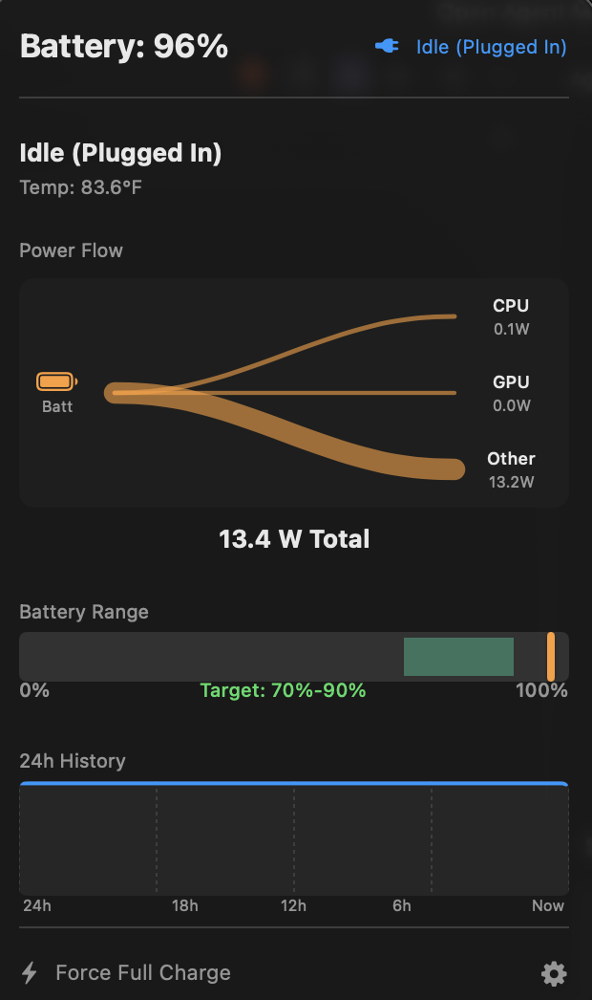

# Smart Charge

> A native macOS menu bar application that implements intelligent battery charging algorithms to maximize battery lifespan while ensuring device availability.

## Overview

<table>
  <tr>
    <td width="60%">
      <p>
        Smart Charge provides real-time power monitoring, customizable charging rules, and beautiful visualizations of your system's energy flow. 
      </p>
      <p>
        It is designed with a philosophy of <strong>Availability First</strong>, ensuring you never have a dead battery when you need it, while intelligently managing charge cycles to prolong battery health.
      </p>
    </td>
    <td width="40%">
      
    </td>
  </tr>
</table>

## Quick Start

### For Users

1.  **Download**: Get `BatterySmartCharge-1.0.0.pkg` from the [Releases](https://github.com/yourusername/smart-charge/releases) page.
2.  **Install**: Double-click the `.pkg` file and follow the installer prompts.
3.  **Authorize**: Enter your password when prompted (required for power monitoring helper).
4.  **Run**: The app will be installed to `/Applications/`. Launch it from there.

The installer automatically sets up the privileged helper needed for real-time power monitoring.

### For Developers

1.  **Clone**: `git clone https://github.com/calebyhan/smart-charge.git`
2.  **Open**: Open `BatterySmartCharge.xcodeproj` in Xcode
3.  **Build**: Press Cmd+R to build and run

To create a distributable installer:
```bash
# Build Release version
xcodebuild -project BatterySmartCharge.xcodeproj -scheme BatterySmartCharge -configuration Release clean build

# Create installer
./create_installer.sh
```

The installer will be created at `dist/BatterySmartCharge-1.0.0.pkg`

**Note**: The installer automatically bundles the `battery` CLI tool. If building the installer yourself, ensure `battery` is installed on your system (`brew install battery`) so it can be bundled.

## Dependencies

The installer includes:
- **PowerMetrics Helper**: Monitors CPU/GPU power consumption (bundled)
- **battery CLI**: Controls charging behavior via SMC ([actuallymentor/battery](https://github.com/actuallymentor/battery)) (bundled)

Both are automatically installed by the .pkg installer with proper permissions.

## Documentation

Comprehensive documentation is available in the [`docs/`](docs/README.md) directory:

*   **[User Guide](docs/USER_GUIDE.md)**: Learn about charging modes, time rules, and the dashboard.
*   **[Architecture](docs/ARCHITECTURE.md)**: High-level system design, data flows, and data models.
*   **[Development](docs/DEVELOPMENT.md)**: Setup, building, testing, and contributing.

## License

MIT License. See [LICENSE](LICENSE) for details.