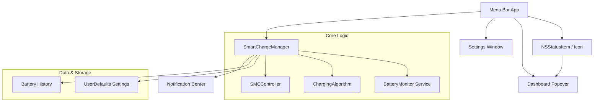
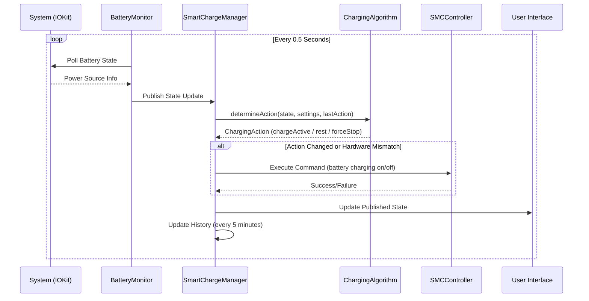

# System Architecture

## High-Level Components

The application is structured as a native macOS menu bar app with background monitoring capability.



### Components Breakdown

*   **AppDelegate**: Entry point. Manages the menu bar status item, popover, and lifecycle events.
*   **SmartChargeManager (Singleton)**: Central coordinator that:
    *   Owns `BatteryMonitor`, `UserSettings`, and `SMCController` instances.
    *   Subscribes to battery state changes and evaluates the charging algorithm.
    *   Maintains 24-hour battery history for the timeline chart.
    *   Handles user overrides (Force Full Charge).
    *   Detects Apple's Optimized Battery Charging and backs off gracefully.
*   **BatteryMonitor**: Reads IOKit power source info every 0.5 seconds. Uses hysteresis and sticky state to handle macOS quirks when charging is disabled via SMC.
*   **ChargingAlgorithm**: Pure function that determines the next `ChargingAction` based on battery state, settings, and previous action. Implements hysteresis bands to prevent oscillation at thresholds.
*   **SMCController**: Interfaces with the `battery` CLI tool to enable/disable charging. Handles daemon conflicts and command rate limiting.
*   **Dashboard Popover**: Visualizes real-time data (Sankey energy flow, battery range indicator, timeline chart).
*   **Settings Window**: Manages user preferences via tabs (General, Time Rules, Power, About).

## Data Flow

The core loop runs every 0.5 seconds to ensure responsive battery management.



## Data Models

### Core Structures

#### BatteryState
Represents the instantaneous state of the system battery.

```swift
struct BatteryState {
    let percent: Int
    let isCharging: Bool
    let isPluggedIn: Bool
    let powerDraw: Double      // Watts (total system power consumption)
    let cpuPower: Double       // Watts (CPU only, from IOReport)
    let gpuPower: Double       // Watts (GPU only, from IOReport)
    let batteryPower: Double   // Watts (positive = charging, negative = discharging)
    let temperature: Double    // Celsius
    let health: Int            // Percentage (MaxCapacity / DesignCapacity)
    let cycleCount: Int
    let timeRemaining: Int?    // Minutes (positive = to full, negative = to empty)

    var hasValidTemperature: Bool  // True if temp reading is valid
}
```

#### ChargingAction
The action determined by the algorithm and executed by SMCController.

```swift
enum ChargingAction: String, Equatable, Codable {
    case chargeActive   // Enable charging via SMC
    case rest           // Disable charging (normal operation)
    case forceStop      // Disable charging (safety cutoff due to temperature)
}
```

#### UserSettings
User-configurable thresholds and preferences.

```swift
class UserSettings: ObservableObject {
    var minThreshold: Int = 20          // Start charging below this
    var maxThreshold: Int = 80          // Stop charging at this
    var lightUsageThreshold: Double = 15.0   // Watts
    var heavyUsageThreshold: Double = 30.0   // Watts
    var launchAtLogin: Bool = true
    var useFahrenheit: Bool = true
    var timeRules: [TimeRule] = []

    // Temperature safety limits (hardcoded)
    let tempPauseThreshold: Double = 38.0    // Pause charging above this
    let tempResumeThreshold: Double = 35.0   // Resume charging below this
    let tempSafetyCutoff: Double = 42.0      // Force stop above this
}
```

#### TimeRule
Defines target ranges for specific time windows.

```swift
struct TimeRule: Codable, Identifiable {
    var id: UUID
    var name: String
    var daysOfWeek: Set<Int>   // 1=Sunday, 7=Saturday (Calendar.weekday)
    var startHour: Int
    var startMinute: Int
    var endHour: Int
    var endMinute: Int
    var targetMin: Int
    var targetMax: Int
    var enabled: Bool

    func isActive(at date: Date) -> Bool  // Handles overnight spans
}
```

## Algorithm Logic

The `ChargingAlgorithm.determineAction()` function follows this priority order:

1. **Sensor Validation**: If temperature reading is invalid (-999°C sentinel), return `.rest` to fail safe.
2. **Safety Cutoff**: If temperature >= 42°C, return `.forceStop`.
3. **Temperature Throttling**: If temperature >= pause threshold (38°C, or 35°C if recovering from heat), return `.rest`.
4. **Unplugged Guard**: If not plugged in, return `.rest` (can't charge without power).
5. **Hard Boundaries**: If percent < minThreshold, return `.chargeActive`. If percent >= maxThreshold, return `.rest`.
6. **Target Range with Hysteresis**: Get active time rule's range (or default). Apply 3% charge threshold and 2% stop threshold to prevent oscillation. Maintain current action within the hysteresis band.

## Power Monitoring

Battery power data comes from multiple sources in priority order:

1. **IOReport** (preferred): Direct access to Energy Model channels for CPU, GPU, DRAM, and system power.
2. **PowerMetrics Helper**: XPC-based helper that runs `powermetrics` for CPU/GPU power on systems where IOReport fails.
3. **SMC Native**: Direct SMC reads for system power (Intel Macs).
4. **Voltage × Current**: Calculated from IOKit for battery discharge power.

## Apple Optimization Coexistence

Smart Charge detects when macOS Optimized Battery Charging is active (stuck at ~80%, wanting to charge but hardware not responding). When detected:
- Enters passive monitoring mode
- Notifies user that Apple's optimization is active
- Resumes control when Apple finishes or conditions change
