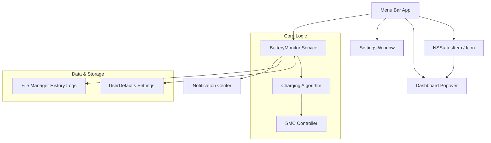
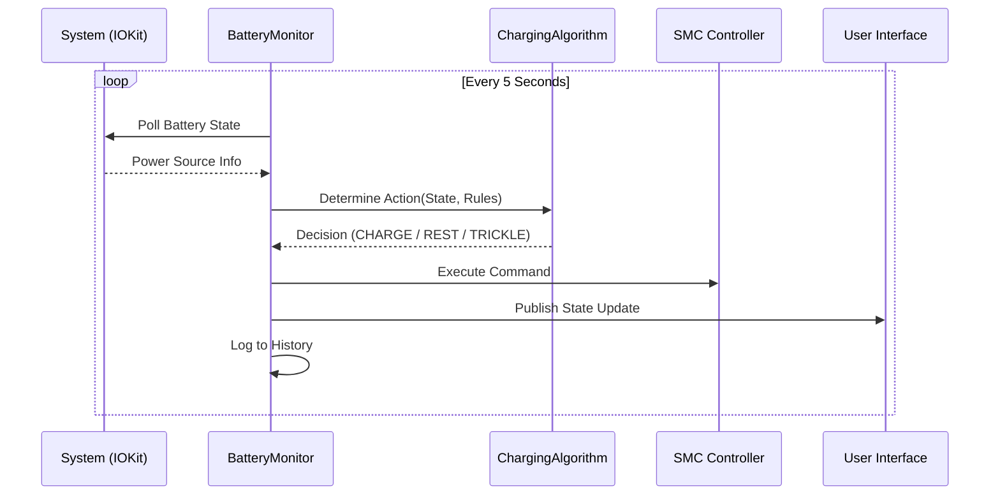

# System Architecture

## High-Level Components

The application is structured as a native macOS menu bar app with a background monitoring capability.



### Components Breakdown

*   **Menu Bar App**: The entry point. Handles the UI lifecycle and user interaction.
*   **BatteryMonitor (Core Logic)**:
    *   Reads IOKit power source info every 5 seconds.
    *   Executes the charging algorithm.
    *   Controls the SMC via the `battery` CLI.
    *   Publishes state updates to the UI.
*   **Dashboard Popover**: Visualizes real-time data (Sankey chart, battery range).
*   **Settings Window**: Manages user preferences and charging rules.

## Data Flow

The core loop of the application runs every 5 seconds to ensure the battery is managed correctly.



## Data Models

### Core Structures

#### BatteryState
Represents the instantaneous state of the system battery.

```swift
struct BatteryState {
    let percent: Int
    let isCharging: Bool
    let isPluggedIn: Bool
    let powerDraw: Double  // Watts
    let temperature: Double  // Celsius
    let health: Int  // Percentage
    let cycleCount: Int
    let timeToEmpty: Int?  // Minutes
    let timeToFull: Int?  // Minutes
}
```

#### chargingMode
User-selectable profiles that determine defaults.

```swift
enum ChargingMode: String, Codable {
    case availability = "Availability"  // 30-90%
    case longevity = "Longevity"        // 20-80%
    case custom = "Custom"              // User defined
}
```

#### TimeRule
Defines target ranges based on the time of day and day of week.

```swift
struct TimeRule: Codable, Identifiable {
    let id: UUID
    var name: String
    var daysOfWeek: Set<Int>  // 0 = Sunday, 6 = Saturday
    var startTime: DateComponents
    var endTime: DateComponents
    var targetMin: Int
    var targetMax: Int
    var enabled: Bool
}
```

#### PowerDrawResponse
Configuration for how the system responds to heavy load.

```swift
struct PowerDrawConfig: Codable {
    var lightUsageThreshold: Double = 15.0  // Watts
    var heavyUsageThreshold: Double = 30.0  // Watts
    
    // Actions: .trickle, .maintain, .active
    var lightUsageAction: ChargingMode
    var heavyUsageAction: ChargingMode
}
```
